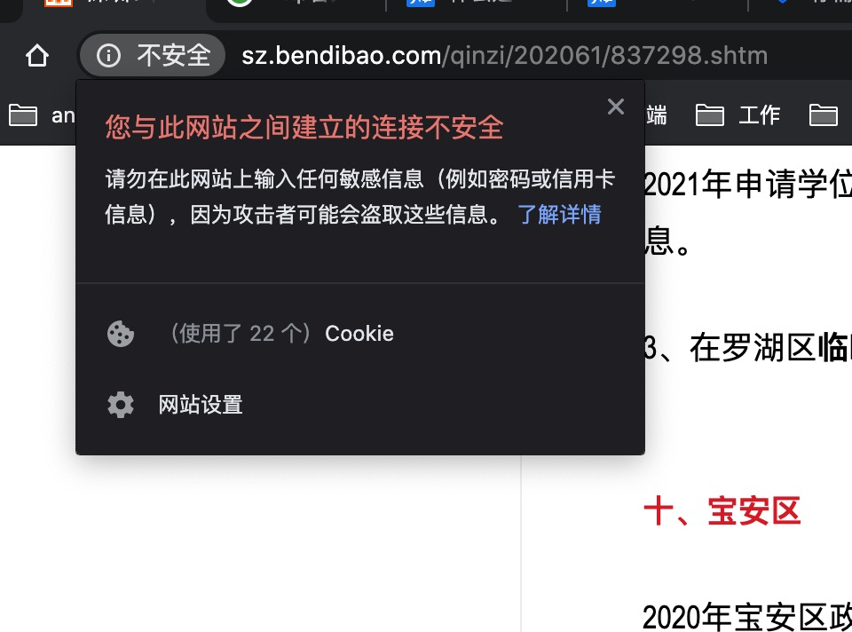
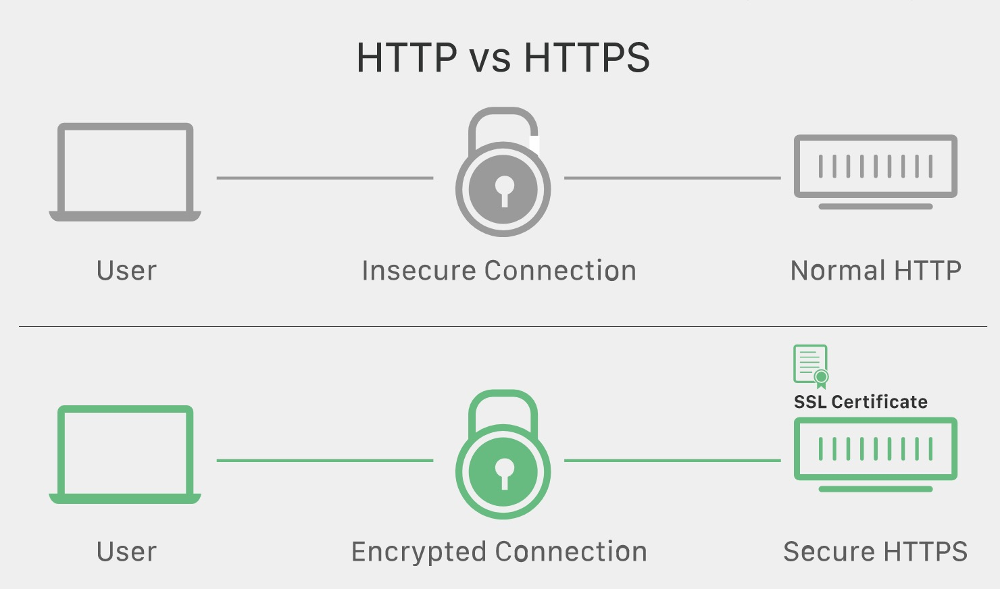

`HTTPS`一直在用至于为什么用当然是安全，但是这些安全提现在那些方面脑子里的概念一直很模糊，本文记录下学习`HTTPS`的心得。

### 一、 `HTTP`的弊端

众所周知`HTTP`是明文传输，带来以下三点风险。

1. **窃听风险**（eavesdropping）：第三方可以获知通信内容。通过一些抓包工具可以获取请求内容。
2.  **篡改风险**（tampering）：第三方可以修改通信内容。由于没有加密认证可以篡改请求内容发送到服务端。
3. **冒充风险**（pretending）：第三方可以冒充他人身份参与通信。

现在主流浏览器都会对不使用`HTTPS`的站点发出警告,下面这张图大家应该都很熟悉了。

### 二、 `SSL和TSL`
既然`HTTP`存在这么多安全问题，那么互联网的先驱们就会想办法解决这些问题，`SSL和TSL`设计的目的就是为了解决`HTTP`的安全问题。期望达到以下目的

1. 所有信息都是加密传播，第三方无法窃听。
2. 具有校验机制，一旦被篡改，通信双方会立刻发现。
3. 配备身份证书，防止身份被冒充。

`HTTPS`是建立在`SSL\TSL`之上的`HTTP`如下图

)

`HTTP`之前是直接和`TCP`通信， `HTTPS`经过`SSL和TSL`加密后和`TCP`通信，从上图看`SSL和TLS`属于传输层。

### 三、`SSL和TSL`如何工作

基本工作原理采用非对称加密如(RSA)协商出对称加密的秘钥，然后使用对称加密进行通信，如下

1. 客户端向服务器端索要并验证公钥。

2. 双方协商生成"对话密钥"。

3.  双方采用"对话密钥"进行加密通信。

上面过程的前两步，又称为"握手阶段"（handshake）。

#### 3.1 握手的具体过程

