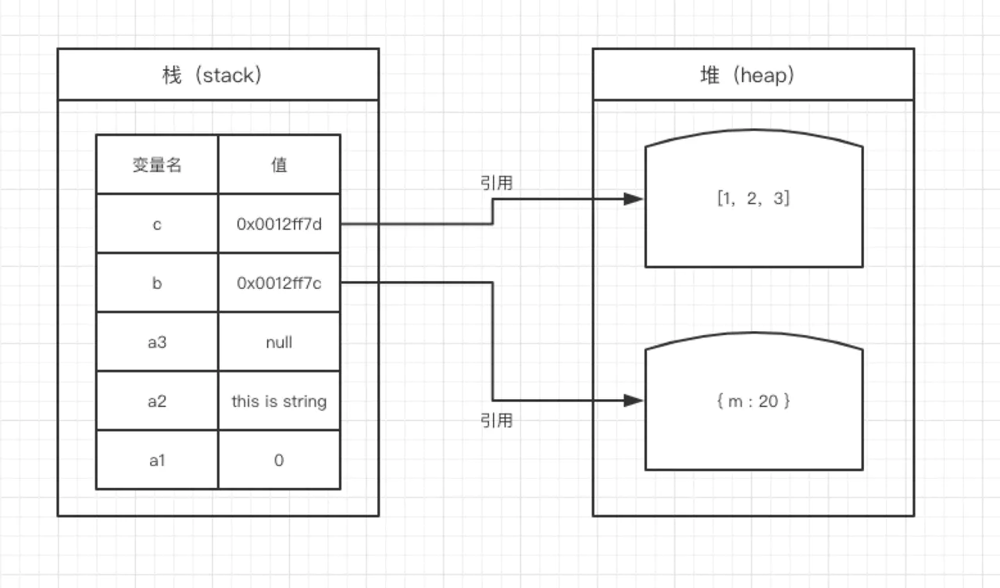

因为`JavaScript`具有自动垃圾回收机制，所以对于前端开发来说，内存空间并不是一个经常被提及的概念，很容易被大家忽视。特别是很多不专业的朋友在进入到前端之后，会对内存空间的认知比较模糊。
在JS中，每一个数据都需要一个内存空间。内存空间又被分为两种，栈内存(`stack`)与堆内存(`heap`) 其实这是操作系统的概念。

栈内存一般储存基础数据类型
` Number String Null Undefined Boolean `
 (`es6`新引入了一种数据类型，`Symbol`)

复制代码最简单的

`var a = 1 `

复制代码我们定义一个变量a，系统自动分配存储空间。我们可以直接操作保存在栈内存空间的值，因此基础数据类型都是按值访问。
数据在栈内存中的存储与使用方式类似于数据结构中的堆栈数据结构，遵循后进先出的原则。

堆内存一般储存引用数据类型
堆内存的
`var b = { xi : 20 }`

复制代码与其他语言不同，`JS`的引用数据类型，比如数组`Array`，它们值的大小是不固定的。引用数据类型的值是保存在堆内存中的对象。`JavaScrip`t不允许直接访问堆内存中的位置，因此我们不能直接操作对象的堆内存空间。看一下下面的图，加深理解。
比较

~~~js
var a1 = 0;   // 栈 
var a2 = 'this is string'; // 栈
var a3 = null; // 栈

var b = { m: 20 }; // 变量b存在于栈中，{m: 20} 作为对象存在于堆内存中 其实就是指针只不过JavaScript弱化了指针这个概念
var c = [1, 2, 3]; // 变量c存在于栈中，[1, 2, 3] 作为对象存在于堆内存中
//复制代码因此当我们要访问堆内存中的引用数据类型时，实际上我们首先是从栈中获取了该对象的地址引用（或者地址指针），然后再从堆内存中取得我们需要的数据。测试
var a = 20;
var b = a;
b = 30;
console.log(a)
// 复制代码
var m = { a: 10, b: 20 }
var n = m;
n.a = 15;
console.log(m.a)
~~~

同理我们在函数中如果返回一个对象， 对象也是在堆中的

~~~js
function test() {
  let b = {a: 1} // b 保存在栈中 {a:1} 保存在堆中
  return b 
}

let a = test() // a指向堆中的 {a: 1}

~~~

