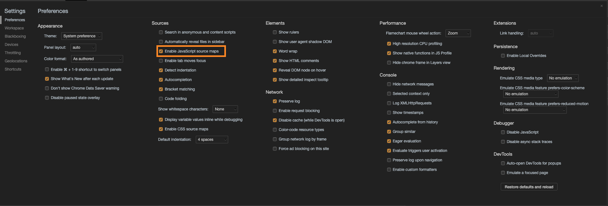
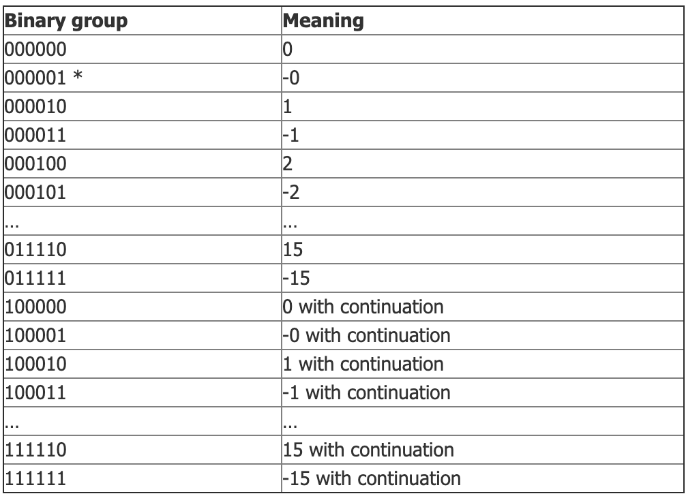
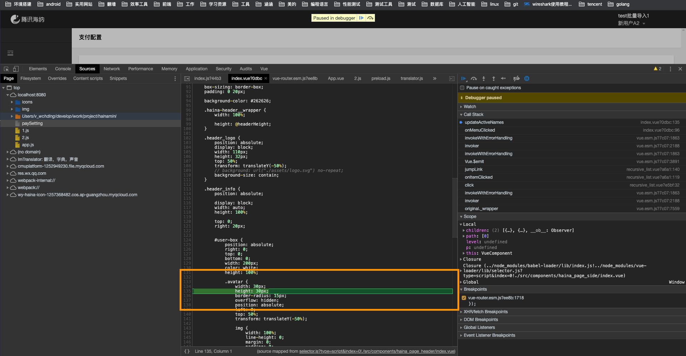

我们在编写`webpack`配置文件都会遇到`devtool`这个属性，它有很多取值，`cheap-eval-source-map`、`cheap-module-eval-source-map`等在之前我只是大概的知道这个属性只是配置如何生成`source-map`但是对每个值具体有什么区别以及`source-map`是如何被应用到浏览器调试的也是一知半解。所以`source-map`到底什么用？

### 一、源码转换

常见的源码转换场景有

* 压缩，减小we年体积。
* 多个文件合并, 减少`HTTP请求数`。
* 其他语言编译成 `javaScript`, 例如TypeScript。

我们编写的代码经过转换已经不是原来的模样了，程序实际运行代码和开发代码不同，一旦有报错通过报错信息你无法清晰定位到出错的源文件
而`source-map`文件就是保存`源文件`和`编译后文件`关系的映射，最简单的例子是如果我们代码里有报错浏览器可以通过`source-map`文件确定当前报错信息在对应`源文件`里是第几行，此时我们点击报错信息就会跳到对应行，而假如没有`source-map`文件是无法做到的。

### 二、前世今生

关于`source-map`的前世今生我们可以

1. `source-map`起初是为了辅助`Cloure Compiler`(一款js压缩优化工具，可类比于uglify-js)以便在浏览器内调试经过后者压缩优化后的代码。
2. 2010年，在第二代即 [Closure Compiler Source Map 2.0](https://docs.google.com/document/d/1xi12LrcqjqIHTtZzrzZKmQ3lbTv9mKrN076UB-j3UZQ/edit?hl=en_US) 中，sourcemap确定了统一的json格式及其余规范，已几乎具有现在的雏形。最大的差异在于mapping算法，也是sourcemap的关键所在。第二代中的mapping已决定使用base 64编码，但是算法同现在有出入，所以生成的.map相比现在要大很多。
3. ，第三代即 [Source Map Revision 3.0] (https://docs.google.com/document/d/1U1RGAehQwRypUTovF1KRlpiOFze0b-_2gc6fAH0KY0k/edit?hl=en_US&pli=1&pli=1#heading=h.3l2f9su3ov2l)出炉了，这也是我们现在使用的sourcemap版本。从文档的命名看来，此时的sourcemap已脱离Clousre Compiler，演变成了一款独立工具，也得到了浏览器的支持。这一版相较于二代最大的改变是mapping算法的压缩换代，使用VLQ编码生成base64前的mapping，大大缩小了.map文件的体积。

### 如何启用source-map

### 三、 sourcemap 文件

**b.js**

~~~js
import c from './c'

export default function b() {
    c()
    console.log('b module')
}

export const test1  = 13
~~~

**webpack打包后的文件**

~~~js
(window["webpackJsonp"] = window["webpackJsonp"] || []).push([[1],{

/***/ "./src/test-source-map.js":
/*!********************************!*\
  !*** ./src/test-source-map.js ***!
  \********************************/
/*! exports provided: default */
/***/ (function(module, __webpack_exports__, __webpack_require__) {

"use strict";
__webpack_require__.r(__webpack_exports__);
/* harmony export (binding) */ __webpack_require__.d(__webpack_exports__, "default", function() { return testSourceMap; });
function testSourceMap() {
  var a = 1;
  console.log(a);
  console.log('test source map');
}

/***/ })

}]);
//# sourceMappingURL=1.d8b4a9c92078616a68e8.js.map
~~~

**map文件**

~~~js
{
    "version":3,
    "sources":["webpack:///./src/test-source-map.js"],
    "names":["testSourceMap","a","console","log"],
    "mappings":";;;;;;;;;;AAAA;AAAA;AAAe,SAASA,aAAT,GAAyB;AACtC,MAAIC,CAAC,GAAG,CAAR;AACAC,SAAO,CAACC,GAAR,CAAYF,CAAZ;AACAC,SAAO,CAACC,GAAR,CAAY,iBAAZ;AACD,C",
    "file":"1.d8b4a9c92078616a68e8.js",
    "sourcesContent":["export default function testSourceMap() {\n  let a = 1;\n  console.log(a);\n  console.log('test source map');\n}"],
    "sourceRoot":""
}
~~~

> * `version`：`sourcemap`版本（现在都是v3）
* `sources`：源文件列表数组如果是多个源文件合并成一个文件那`sources`就会有多个
* `sourcesContent`: 原文件内容这也是个数组和`sources`是相对应的
* `names`: 原变量名与属性名（压缩时可能会改变变量名称）
* `mapping`：记录位置信息的字符串
* `file`：编译后文件名

### 四、mappings属性

mapping属性分为三层

> * 行对应 以分号(;)标识，每个分号对应转换后源码的一行。所以第一个分号前的内容，就对应源码的第一行，以此类推。
* 列对应 以逗号(,)标识每个逗号对应转换前的一个分割
*  位置转换 每个逗号分割的四个`VLQ`编码转换过后代表该代码转换前源码的位置。

#### 五、位置对应原理

>  1. 第一位 表示这个位置在（转换后的代码的）的第几列。
> 2. 第二位，表示这个位置属于`sources`属性中的哪一个文件。
> 3. 第三位，表示这个位置属于转换前代码的第几行。
> 4. 第四位，表示这个位置属于转换前代码的第几列。
> 5. 第五位，表示这个位置属于names属性中的哪一个变量。

**注意**

因为并不是每个位置都会有对应的`names`变量所以第五位不是必须的。
另外应为`VLQ`编码是变长的所以有可能一位`VLQ`编码是由多个`字母`组成

如果某个位置是AAAAA，由于A在VLQ编码中表示0，因此这个位置的五个位实际上都是0。它的意思是，该位置在转换后代码的第0列，对应sources属性中第0个文件，属于转换前代码的第0行第0列，对应names属性中的第0个变量。

###六 VLQ编码

Base64编码表

个VLQ小节有6位（所以刚好适合通过base64转换成字符呀），第一位代表连续，最后一位一般代表正负，所以中间至少有4位可以表示value。

可以看到`-15~15`都可以用一个`VLQ`小节来表示。当`|Number|>15`时，则需要用到多个`VLQ`小节。另外，正负只需用第一小节的最后一位表示。所以多个小节时，第>1个小节的第6位可以不代表正负，也代表内容。

将16改写成 `VLQ`编码

> 1. 将16改写成二进制形式10000。
> 2. 在最右边补充符号位。因为16大于0，所以符号位为0，整个数变成100000。
> 3. 第三步，从右边的最低位开始，将整个数每隔5位，进行分段，即变成1和00000两段。如果最高位所在的段不足5位，则前面补0，因此两段变成00001和00000。
>4. 将两段的顺序倒过来，即00000和00001。
> 5. 在每一段的最前面添加一个"连续位"，除了最后一段为0，其他都为1，即变成100000和000001。
> 6. 将每一段转成Base 64编码。

`100000` `Base64` 为`g` `000001`为`B`所以16的`vlq`编码是`gB`

### webpack的source-map

`webpack`的 `devtool`有多种取值其实都是下列值的排列组合

 `[inline-|hidden-|eval-][nosources-][cheap-[module-]]source-map.`
 
 
> * `inline`  source map 转换为 DataUrl 后添加到 bundle 中。
> * `cheap` 没有列映射(column mapping)的 source map，忽略 loader source map。
> * `hidden` 完整的生成`source-map`不会为 bundle 添加引用注释。
> * `nosources` 创建的 source map 不包含 sourcesContent(源代码内容)。它可以用来映射客户端上的堆栈跟踪，而无须暴露所有的源代码。你可以将 source map 文件部署到 web 服务器。注意这仍然会暴露反编译后的文件名和结构，但它不会暴露原始代码。
>* `module` 源自 loader 的 source map 会得到更好的处理结果(这里好像并不是很好用)。然而，loader source map 会被简化为每行一个映射(mapping)。

我们在开发环境中最常用的是`cheap-module-eval-source-map`因为它的重新构建速度在`webpack`的官方文档里介绍是快速的。但是这里带了`cheap`上面我们有讲`cheap`会忽略`loader`的`source-map`, 当代码比较复杂时就会出现问题， 就那`vue-loader`来说

~~~js
...
// 更新高亮name数组
    updateActiveNames (children, path) {
      // 重置
      debugger
      this.activeName.length = 0
      let level = 0
      let p = children[path[level]]
      this.activeName.push(p.name)
      while (p.children && level < path.length) {
        level++
        p = p.children[path[level]]
        this.activeName.push(p.name)
      }
    }
   ...
~~~

我在单文件组件里的函数里写了一个`debuger`但是当我调试时这里定位并不准确

如果出现这个问题可以尝试下其他开发环境的选项

1. `eval` 最快的初始化速度和构建速度 每个模块都使用 eval() 执行，并且都有 //@ sourceURL。此选项会非常快地构建。主要缺点是，由于会映射到转换后的代码，而不是映射到原始代码（没有从 loader 中获取 source map），所以不能正确的显示行数。
2.  `eval-source-map` 每个模块使用 eval() 执行，并且 source map 转换为 DataUrl 后添加到 eval() 中。初始化 source map 时比较慢，但是会在重新构建时提供比较快的速度，并且生成实际的文件。行数能够正确映射，因为会映射到原始代码中。它会生成用于开发环境的最佳品质的 source map。
3. `cheap-eval-source-map` - 类似 eval-source-map，每个模块使用 eval() 执行。这是 "cheap(低开销)" 的 source map，因为它没有生成列映射(column mapping)，只是映射行数。它会忽略源自 loader 的 source map，并且仅显示转译后的代码，就像 eval devtool
4. `cheap-module-eval-source-map` 类似 cheap-eval-source-map，并且，在这种情况下，源自 loader 的 source map 会得到更好的处理结果。然而，loader source map 会被简化为每行一个映射(mapping)。

在生产环境推荐用默认值`none`或者

1. `hidden-source-map`  与 source-map 相同，但不会为 bundle 添加引用注释。如果你只想 source map 映射那些源自错误报告的错误堆栈跟踪信息，但不想为浏览器开发工具暴露你的 source map，这个选项会很有用
2. `nosources-source-map`  创建的 source map 不包含 sourcesContent(源代码内容)。它可以用来映射客户端上的堆栈跟踪，而无须暴露所有的源代码。你可以将 source map 文件部署到 web 服务器。

### 参考

[sourcemap知多少](https://juejin.im/post/5d3ef5105188255d9205ba3a)

[JavaScript Source Map 详解](https://www.ruanyifeng.com/blog/2013/01/javascript_source_map.html)