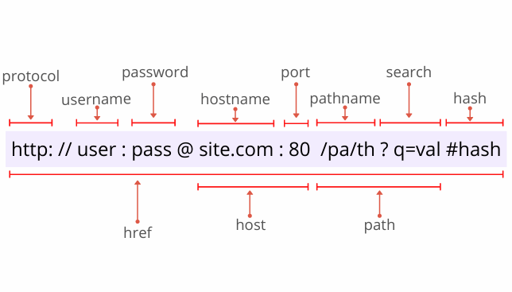

### 使用URL和URLSearchParams

~~~js
// URL 还可以接受两个参数， 一个是相对地址， 一个是base地址二者组装成url
const url = new URL('https://www.example.com:8080/?a=1&b=2#page0');
console.log(url)
// {
//   hash: "#page0"
//   host: "www.example.com:8080"
//   hostname: "www.example.com"
//   href: "https://www.example.com:8080/?a=1&b=2#page0"
//   origin: "https://www.example.com:8080"
//   password: ""
//   pathname: "/"
//   port: "8080"
//   protocol: "https:"
//   search: "?a=1&b=2"
//   searchParams: URLSearchParams {}
//   username: ""
// }
~~~

`searchParams` 就是`query`他和新建一个`URLSearchParams`实例的结果一样, 可以用迭代器遍历

~~~js
const query = new URLSearchParams('a=1&b=2')
for (let p of query) {
  console.log(p)
}
// 直接根据键值获取
query.get('a') // [a, 1], [b, 2]
// append

query.append('a', 3) // [a, 1], [b, 2], [a, 3]
// get
query.get('a') // 1
// getAll
query.getAll('a') // 1, 3
// has
query.has('a') // true
query.has('c') // false
// values 获取值迭代器
const values = query.valuse()
for (let v of values) {
  console.log(v) // [1, 2, 3]
}
// 获取键值
const keys = query.keys()
for (let key of keys) {
  console.log(key) // a, b, a
}
// sort 根据键值排序
query.sort() // 此时键的顺序是 a, a, b
//toString 转换为query格式
query.toString() // a=1&a=3&b=2
// 删除某个键值
query.delete('a') // a相关的全部删除
// 重新设置某个键
query.set('b', 3) // 相当于 query.delete('b') query.append('b', 3)
~~~

因为`URL和URLSearchParams`都不支持`ie11`所以`ie11`下需要`polyfill`

### 正则解析

~~~js
var parseUrl = function(url) {
    var urlParseRE = /^\s*(((([^:\/#\?]+:)?(?:(\/\/)((?:(([^:@\/#\?]+)(?:\:([^:@\/#\?]+))?)@)?(([^:\/#\?\]\[]+|\[[^\/\]@#?]+\])(?:\:([0-9]+))?))?)?)?((\/?(?:[^\/\?#]+\/+)*)([^\?#]*)))?(\?[^#]+)?)(#.*)?/
    var matches = urlParseRE.exec(url || "") || [];
    return {
        href:         matches[0] || "",
        hrefNoHash:   matches[1] || "",
        hrefNoSearch: matches[2] || "",
        domain:       matches[3] || "",
        protocol:     matches[4] || "",
        doubleSlash:  matches[5] || "",
        authority:    matches[6] || "",
        username:     matches[8] || "",
        password:     matches[9] || "",
        host:         matches[10] || "",
        hostname:     matches[11] || "",
        port:         matches[12] || "",
        pathname:     matches[13] || "",
        directory:    matches[14] || "",
        filename:     matches[15] || "",
        search:       matches[16] || "",
        hash:         matches[17] || ""
    };
};
~~~

## a标签

创建一个`a`标签将`url`赋值给 `href`

~~~js
function parseUrl(url) {
  var anchorElement = doc.createElement('a');
  anchorElement.href = url;
  return {
    href: a[href],
    origin: a[origin],
    protocol: a[proto],
    username: a[username],
    password: a[password],
    host: a[host],
    hostname: a[hostname],
    port: a[port],
    pathname: a[pathname],
    search: a[search],
    hash = a[hash]
  }
}
~~~