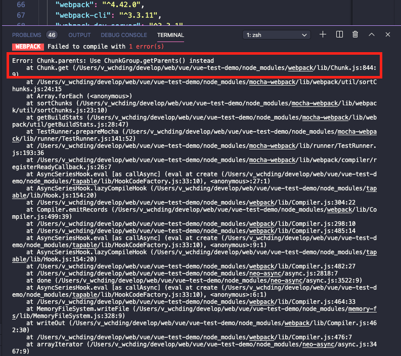
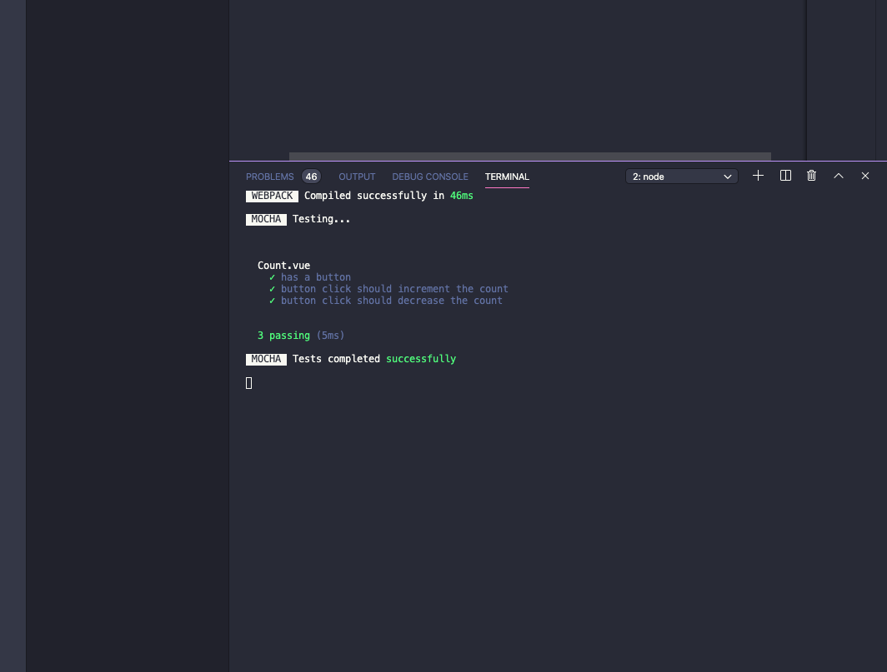
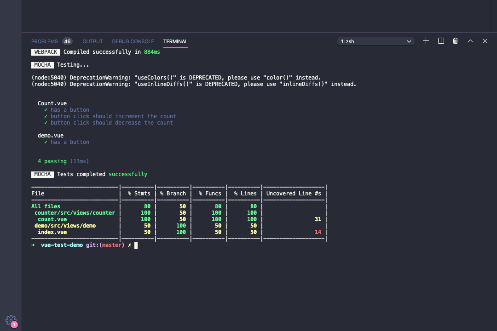
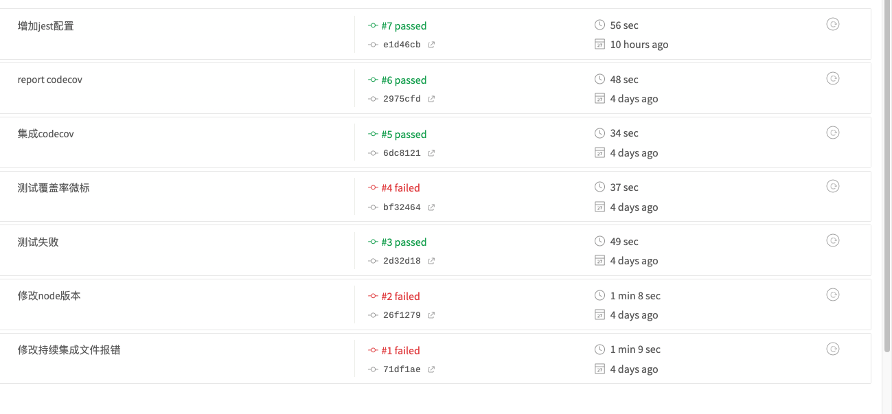

# 前言

之前的项目好像对单元测试都很不重视，这里主要是想简单的实践一下单元测试，也为之后的项目引入单元测试做准备。

### 什么是单元测试？

在计算机编程中，单元测试（英语：Unit Testing）又称为模块测试，是针对程序模块（软件设计的最小单位）来进行正确性检验的测试工作。程序单元是应用的最小可测试部件。在过程化编程中，一个单元就是单个程序、函数、过程等；对于面向对象编程，最小单元就是方法，包括基类（超类）、抽象类、或者派生类（子类）中的方法。

比如对于下面`decrease`，我们可以编写出以下几个测试用例：

1. 输入正数 `1` 、 `1.99` 期待结果减1
2. 输入负数 `0`、 `-1` 期待结果不变
3. 输入非数值  `None` 、`test` 期待结果不变或抛出类型错误

~~~js
   decrease() {
      if (this.count > 0) --this.count;
    }
~~~
上面的测试用例合起来就是一个完整的单元测试, 这个单元测试能够保证`decrease`函数能够按照预期工作。

### 单元测试的好处

现在假设我们`单元测试`已经全部跑通过了来了新需求我们需要修改`decrease`函数如下，这样我们再跑一次单元测试部分之前的测试用例就会失败，这时候要么是我们的改动有问题，要么就是测试用例有问题，要做响应的修改以保证单元测试通过，确保我们的修改是正确的。

~~~js
  decrease() {
      if (this.count > 1) --this.count;
    }

~~~

对于`测试驱动开发(TDD)`要求我们再编写功能之前首先编写`测试代码`,因为一个功能单元的输入输出是确定的，所以测试代码也是确定的同样对于修改我们也可以这样做先编写对应的测试代码之后再编写功能代码。单元测试的好处就是可以在将来修改代码时很大程度的保证代码的正确性。

### 如何编写单元测试？

单元测试大致有三部分组成

* 测试框架
* 测试运行器
* 断言库

### 测试框架

`Vue Test Utils`是`Vue.js`官方的单元测试实用工具库有详细的文档和实践`demo`.

我们将其作为开发依赖安装

~~~js
npm install --save-dev @vue/test-utils
~~~

Vue Test Utils 依赖浏览器环境。技术上讲你可以将其运行在一个真实的浏览器，但是我们并不推荐，因为在不同的平台上都启动真实的浏览器是很复杂的。我们推荐取而代之的是用 JSDOM 在 Node 虚拟浏览器环境运行测试。

Jest 测试运行器自动设置了 JSDOM。对于其它测试运行器来说，你可以在你的测试入口处使用 jsdom-global 手动设置 JSDOM。

~~~bash
npm install --save-dev jsdom jsdom-global
~~~

~~~js
// 在测试的设置 / 入口中
require('jsdom-global')()
~~~

### 测试运行器

主流测试运行器 `Vue Test Utils` 都能够支持。

`vue`推荐下面两个测试运行器：

`Jest` 是功能最全的测试运行器。它所需的配置是最少的，默认安装了 `JSDOM`，内置断言且命令行的用户体验非常好。不过你需要一个能够将单文件组件导入到测试中的预处理器。我们已经创建了 `vue-jest` 预处理器来处理最常见的单文件组件特性，但仍不是 `vue-loader 100%` 的功能。

`mocha-webpack` 是一个 `webpack + Mocha` 的包裹器，同时包含了更顺畅的接口和侦听模式。这些设置的好处在于我们能够通过 webpack + vue-loader 得到完整的单文件组件支持，但这本身是需要很多配置的。

这里选择`mochal-webpack`主要是因为完整的支持 `vue-loader`和顺畅的侦听模式，侦听模式可以让我们每次保存文件都跑一遍测试用例。而且这里的侦听是区分文件的比如说你改了`count.vue`那么他只会重新跑和`count.vue`相关的单元测试。

~~~bash
npm install --save-dev @vue/test-utils mocha mocha-webpack@^2.0.0-beta.0
~~~
这里的`mochal-webpack`我们指定`2.0.0-beta.0`是适配了最新的`mocha`版本的，如果你安装`1.1.0`会有如下错误

接下来我们需要在 package.json 中定义一个测试脚本。

~~~json
 "scripts": {
    "test": "cross-env NODE_ENV=test mocha-webpack --webpack-config ./build/webpack.test.conf.js --require test/setup.js test/**/*.spec.js",
    "test:watch": "cross-env NODE_ENV=test mocha-webpack --watch  --webpack-config ./build/webpack.test.conf.js --require test/setup.js --recursive test/**/*.spec.js",
  },
~~~

参数的含义

* `--webpack-config` 指定`webpack`的配置文件
* `--require` 指定前置文件会在任何测试之前运行
* ` test/**/*.spec.js` 指定测试文件所在目录， 一般测试文件都以这两种格式命名`.spec.js`和`.test.js`.

### 选用一个断言库

这里我们将使用 `expect` 且令其全局可用，这样我们就不需要在每个测试文件里导入它了：

~~~bash
npm install --save-dev expect
~~~
全局引用

~~~js
require('jsdom-global')()

global.expect = require('expect')
~~~

### 添加一个测试

我创建一个一个`Counter.vue`组件

~~~js
<template>
  

    
{{ count }}

    <button
      class="increase_button"
      @click="increase"
    >
      +
    </button>
    <button
      class="decrease_button"
      @click="decrease"
    >
      -
    </button>
  

</template>

~~~

然后创建一个名为 test/counter/Counter.spec.js 的测试文件并写入如下代
码：

~~~js
import Counter from '@/views/counter/count.vue';
import { mount } from '@vue/test-utils';

describe('Count.vue', () => {
  const wrapper = mount(Counter);
  // 也便于检查已存在的元素
  it('has a button', () => {
    expect(wrapper.contains('button')).toBe(true);
  });
  it('button click should increment the count', () => {
    expect(wrapper.vm.count).toBe(0);
    const button = wrapper.find('.increase_button');
    button.trigger('click');
    expect(wrapper.vm.count).toBe(1);
  });
  it('button click should decrease the count', () => {
    expect(wrapper.vm.count).toBe(1);
    const button = wrapper.find('.decrease_button');
    button.trigger('click');
    expect(wrapper.vm.count).toBe(0);
  });
});
~~~

现在我们运行测试

~~~bash
npm run test
~~~

### 测试覆盖率

我们用`nyc`生成测试报告有两种方式

#### 只用`babel`需要安装下列依赖

~~~bash
npm install --save-dev  nyc @babel/register babel-plugin-istanbul
~~~
然后在 `package.json`中加入以下配置

~~~json
nyc": {
    "all": true,
    "sourceMap": false,
    "instrument": false,
    "require": [
      "@babel/register"
    ],
    "extension": [
      ".vue",
      ".js"
    ],
    "include": [
      "src/**/*.vue",
      "src/**/*.js"
    ],
    "exclude": [
      "src/coverage"
    ]
  },
~~~
这里配置的含义是

1. `all` 生成所有文件
2. `sourceMap`  instrument 和 sourceMap: 设置为 false，禁用 nyc 去 instrumenting 和 sourceMap 你的代码，后续我们指定babel-plugin-istanbu 去完成。
3. `instrument` instrument 和 sourceMap: 设置为 false，禁用 nyc 去 instrumenting 和 sourceMap 你的代码，后续我们指定 babel-plugin-istanbu 去完成。
4. `extension` 配置处理文件的扩展名
5. `include` 数组需要生成测试覆盖率的文件
6. `exclude`  不需要生成测试覆盖率的文件
在 `.babelrc`中加入

~~~json
"test": {
      "presets": [
        [
          "@babel/preset-env",
          {
            "useBuiltIns": "entry",
            // bablel jest
            "targets": {  "node": "current" }
          }
        ]
      ],
      "plugins": ["istanbul"]
    }
~~~

在 `package.json`中

~~~json
"scripts": {
    "test": "cross-env NODE_ENV=test mocha-webpack --webpack-config ./build/webpack.test.conf.js --require test/setup.js test/**/*.spec.js",
    "coverage": "cross-env NODE_ENV=test nyc --cmd ./  --reporter=json --reporter=text  npm run test"
  },
~~~
现在我们运行

~~~js
npm run coverage
~~~

#### 使用`istanbul-instrumenter-loader`

安装以下依赖

~~~bash
npm install --save-dev  nyc istanbul-instrumenter-loader
~~~
`nyc`配置和上述相同

在`webpack`配置如下

`webpack.test.conf.js`

~~~js
const merge = require('webpack-merge');
// 引入dev配置， prod配置中 runtimeChunk: 'single' 会导致watch模式无效
const devConf = require('./webpack.dev.conf');
const path = require('path');

module.exports = merge(devConf, {
  module: {
    rules: [
      // 使用babel
      {
        test: /\.(js|ts)/,
        use: {
          loader: 'istanbul-instrumenter-loader',
          options: { esModules: true }
        },
        include: path.resolve(__dirname, '../src/')
      },
    ],
  },
  // 源码表在 mocha-webpack 中需要通过内联的方式获取。推荐配置为：
  devtool: 'inline-cheap-module-source-map',
  //  暴露`Npm`依赖
  //  在测试中我们很可能会导入一些 NPM 依赖——
  //  这里面的有些模块可能没有针对浏览器的场景编写，也不适合被 webpack 打包。
  // 另一个考虑是为了尽可能的将依赖外置以提升测试的启动速度。
  // 我们可以通过 webpack-node-externals 外置所有的 NPM 依赖：
  externals: [require('webpack-node-externals')()],
});
~~~

运行 `npm run coverage`和上述结果一样

### 侦听模式

我们加入下列`npm`执行脚本

~~~json
"scripts": {
    "test:watch": "cross-env NODE_ENV=test mocha-webpack --watch  --webpack-config ./build/webpack.test.conf.js --require test/setup.js --recursive test/**/*.spec.js"
  }
~~~

这样我们执行 

~~~bash
npm run test:watch
~~~

这样就开启了侦听模式此时我们修改源文件或者测试文件就会重新跑一遍相关文件的单元测试。

注意这里的`webpack`配置, 合并的是`webpack.dev.conf`因为在`webpack.prod.conf`, 存在 ` runtimeChunk: 'single'`会导致侦听模式出问题。

~~~js
const merge = require('webpack-merge');
// 引入dev配置， prod配置中 runtimeChunk: 'single' 会导致watch模式无效
const devConf = require('./webpack.dev.conf');
const path = require('path');

module.exports = merge(devConf, {
  module: {
    rules: [
      // 使用babel
      {
        test: /\.(js|ts)/,
        use: {
          loader: 'istanbul-instrumenter-loader',
          options: { esModules: true }
        },
        include: path.resolve(__dirname, '../src/')
      },
    ],
  },
  // 源码表在 mocha-webpack 中需要通过内联的方式获取。推荐配置为：
  devtool: 'inline-cheap-module-source-map',
  //  暴露`Npm`依赖
  //  在测试中我们很可能会导入一些 NPM 依赖——
  //  这里面的有些模块可能没有针对浏览器的场景编写，也不适合被 webpack 打包。
  // 另一个考虑是为了尽可能的将依赖外置以提升测试的启动速度。
  // 我们可以通过 webpack-node-externals 外置所有的 NPM 依赖：
  externals: [require('webpack-node-externals')()],
});
~~~

### 持续集成

持续集成 ,能够帮助我们在提交代码后自动执行一些构建测试步骤，这里我们用`travis-ci`的免费服务。

1. 用`github`登录`travis-ci`.
2. 选择相应仓库，激活仓库
3. 在仓库内添加`.travis.yml`配置文件。

~~~yml
sudo: required
language: node_js
node_js: 
  - '12'
script:
  - npm run build
  - npm run coverage
  - npm run report-coverage

~~~
现在我们提交就会自动执行构建和测试

### 上传测试报告

这里用`codecov`上传线上测试报告，

#### 登录授权
首选登录 `codecov`选择仓库获取`token`

我们将这个`https://codecov.io/bash`的bash脚本保存在本地`upload-codecov.sh`然后在`package.json`添加如下运行脚本
 
 ~~~json
 {
   "script": "report-coverage": "bash ./upload-codecov.sh -token"

 }
 ~~~

执行

~~~js
npm run report-coverage
~~~
再次登录`codecov`就可以看到测试记录了

