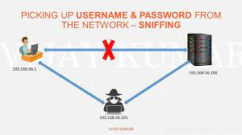

`HTTPS`一直在用至于为什么用当然是安全，但是这些安全提现在那些方面脑子里的概念一直很模糊，本文记录下学习`HTTPS`的心得。

## `HTTP`的弊端

众所周知`HTTP`是明文传输，带来以下三点风险。

#### **窃听风险**（eavesdropping）

由于`HTTP`明文传输不做任何加密，在网络传输的任意节点， 第三方可以获知通信内容。通过一些抓包工具可以获取请求内容，即使通过了`HTTPS`加密处理报文依然有可能会被窃听只是`加密后的报文`破解起来没那么困难。

#### **篡改风险**（tampering）

因为无法验证报文的完整性， 第三方可以修改通信内容。由于没有加密认证可以篡改请求内容发送到服务端。

#### **冒充风险**（pretending）

无法验证通信方身份，任何人可以发送请求， 第三方可以冒充他人身份参与通信, 如下图中间人攻击。

现在主流浏览器都会对不使用`HTTPS`的站点发出警告,下面这张图大家应该都很熟悉了。

## 披着`SSL和TSL`外壳的`HTTP`

既然`HTTP`存在这么多安全问题,`SSL和TSL`为了解决`HTTP`的安全问题就诞生了。期望达到以下目的

1. 所有信息都是加密传播，第三方无法窃听。
2. 具有校验机制，一旦被篡改，通信双方会立刻发现。
3. 配备身份证书，防止身份被冒充。

`HTTPS`是建立在`SSL\TSL`之上的`HTTP`如下图

)

`HTTP`之前是直接和`TCP`通信， `HTTPS`经过`SSL和TSL`加密后和`TCP`通信，从上图看`SSL和TLS`属于传输层。

#### 三、`SSL和TSL`如何工作

基本工作原理采用非对称加密如(RSA)协商出对称加密的秘钥，然后使用对称加密进行通信，如下

~~~js
第一步，爱丽丝给出协议版本号、一个客户端生成的随机数（Client random），以及客户端支持的加密方法。

第二步，鲍勃确认双方使用的加密方法，并给出数字证书、以及一个服务器生成的随机数（Server random）。

第三步，爱丽丝确认数字证书有效，然后生成一个新的随机数（Pre-master secret），并使用数字证书中的公钥，加密这个随机数，发给鲍勃。

第四步，鲍勃使用自己的私钥，获取爱丽丝发来的随机数（即Prem-aster secret）。

第五步，爱丽丝和鲍勃根据约定的加密方法，使用前面的三个随机数，生成"对话密钥"（session key），用来加密接下来的整个对话过程。
上面过程的前两步，又称为"握手阶段"（handshake）。
~~~

#### 握手的具体过程

## `HTTPS`

### `HTTPS`证书

#### 证书包含哪些信息

> * 颁发机构信息
> * 公钥
> * 公司信息
> * 域名
> * 有效期
> *指纹

#### 权威机构(`CA`)证书

权威机构需要对其颁发的证书进行信用背书，只要是权威机构生成的证书，我们就认为是合法的。

`CA`证书的制作流程

> * CA机构拥有非对称加密的私钥和公钥
> * CA对证书明文信息进行hash
> * 对hash后的值用私钥加密，得到数字签名

CA机构颁发的证书包含（证书内容的明文+签名）

另外浏览器都会内置`CA`机构的`公钥`用于验证用户证书的有效性。

#### 自签名证书

通过开源的`OpenSSL`每个人都可以构建一套自己的证书，但是自签名证书是不被浏览器认可的，也比较容易理解如果每个人都可以构建如何验证证书的安全性和有效性呢？ 这样就带来伪装风险。

#### 如何验证证书的合法性

> 1. 验证域名、有效期等信息是否正确。证书上都有包含这些信息，比较容易完成验证；

> 2. 判断证书来源是否合法。每份签发证书都可以根据验证链查找到对应的根证书，操作系统、浏览器会在本地存储权威机构的根证书，利用本地根证书可以对对应机构签发证书完成来源验证；

> 3. 判断证书是否被篡改。需要与 CA 服务器进行校验；

> 4. 判断证书是否已吊销。通过CRL（Certificate Revocation List 证书注销列表）和 OCSP（Online Certificate Status Protocol 在线证书状态协议）实现，其中 OCSP 可用于第3步中以减少与 CA 服务器的交互，提高验证效率以上任意一步都满足的情况下浏览器才认为证书是合法的。

### 如何解决`HTTP`问题
 
#### 解决窃听风险

 `HTTPS`对报文加密而且由于对称加密的秘钥是通过非对称加密协商的比较安全，所以大大降低被窃听信息泄露的风险。

#### 解决信息篡改风险

黑客依然可以截获数据包，但是全都是经过对称加密的密钥加密的， 当然也可以篡改但是由于拿不到对称加密的秘钥篡改也没什么意义， 如果被篡改了服务端就会解密失败的。

#### 解决冒充身份的风险

如果证书被篡改，浏览器就提示不可信，终止通信，如果验证通过，说明公钥没问题，一定没被篡改

### `HTTPS`缺点

> 1. HTTPS协议握手阶段比较费时，会使页面的加载时间延长近50%，增加10%到20%的耗电；

> 2. HTTPS连接缓存不如HTTP高效，会增加数据开销和功耗，甚至已有的安全措施也会因此而受到影响；

> 3. SSL证书需要钱，功能越强大的证书费用越高，个人网站、小网站没有必要一般不会用。

> 4. SSL证书通常需要绑定IP，不能在同一IP上绑定多个域名，IPv4资源不可能支撑这个消耗。

> 5. HTTPS协议的加密范围也比较有限，在黑客攻击、拒绝服务攻击、服务器劫持等方面几乎起不到什么作用。最关键的，SSL证书的信用链体系并不安全，特别是在某些国家可以控制CA根证书的情况下，中间人攻击一样可行。

