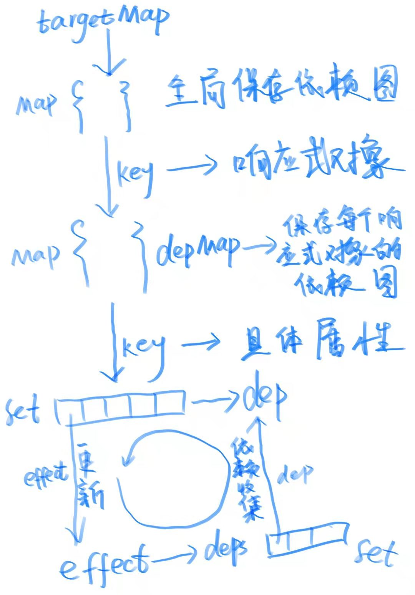
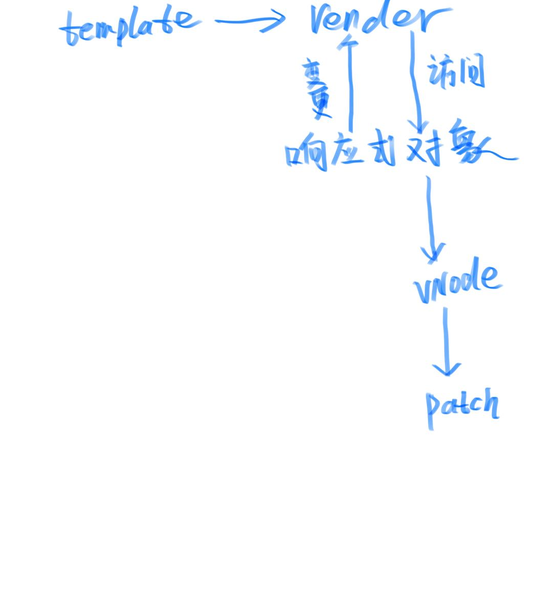

# `Vue3.0`响应式原理

## 追踪类型(track)和触发类型(trigger)

`vue`的响应式时基于发布订阅模式的， 当(订阅者)访问响应式对象的属性时会进行依赖(发布者)追踪(track)这一步称为(订阅)， 当依赖发生变化时通知相应的订阅者这一步称为(发布)，比如 我们再`Vue`模板中访问了响应式属性，也就是订阅了这个属性，当这个属性发生变化时就会通知相应的渲染函数(订阅者)执行重新渲染。

### 追踪类型(track)

追踪类型也就是订阅类型

> * get 用于track 属性的访问(包含数组下标式的访问), 以及`Map`， `get`做操 
> * has 用于 tack in操作符， 以及`Map` 和`Set`的`has`操作
> * iterate track 响应式对象的`getOwnPropertySymbols(proxy)、Object.keys(proxy)、for...in`, 以及`Map` 和`Set`的`size`和`forEach`操作

### 触发类型

> * set 属性的修改， 以及`Map`的修改原有属性值操作
> * add 属性的添加， 以及 `Map`的`set`新属性 和`Set`的`add`操作。
> * delete  属性的删除 如 `delete test.x`等 以及`Map`和`Set` 的`delete`操作。
> * clear 用于 `Map`和`Set`集合类型的 `clear`操作

### ref

用于将原始类型，转换为响应式的类型

#### 用法

~~~js

import { ref } from 'vue'
const refInt = ref(0)

refInt.value++ // 响应式的会追踪依赖， 可以在模板中、computed、 和watch中监听变化

~~~

#### 模板中自动`unRef`

为了减轻使用`ref`的心智复旦模板中的`ref`和响应式对象中的`ref`会自动`unRef` 如下

~~~js
import { ref, reactive } from 'vue'
const refInt = ref(0)

const template = `
{{ refInt }}
`  // 自动 unRef 不用显示写 refInt.value

const reactiveObj = reactive({ test: refInt })

console.log(reactiveObj.test) // 自动 unRef 不用显示写 reactiveObj.test.value
~~~

`unRef`的实现如下

~~~js
function unRef (val) {
  return isRef(val) ? val.value : val
} 
~~~

#### ref 的实现

~~~js

export function ref(value?: unknown) {
  return createRef(value)
}

class RefImpl<T> {
  private _value: T

  public readonly __v_isRef = true

  constructor(private _rawValue: T, public readonly _shallow = false) {
    this._value = _shallow ? _rawValue : convert(_rawValue)
  }

  get value() {
    track(toRaw(this), TrackOpTypes.GET, 'value')
    return this._value
  }

  set value(newVal) {
    if (hasChanged(toRaw(newVal), this._rawValue)) {
      this._rawValue = newVal
      this._value = this._shallow ? newVal : convert(newVal)
      trigger(toRaw(this), TriggerOpTypes.SET, 'value', newVal)
    }
  }
}

function createRef(rawValue: unknown, shallow = false) {
  if (isRef(rawValue)) {
    return rawValue
  }
  return new RefImpl(rawValue, shallow)
}
~~~

其实就是把原始类型转换为 `get`和`set`属性， 类似 `Vue2`的响应式属性。

#### 浅的和深的

默认是“深的“如果传入`ref`的是一个对象则会调用`reactive`将对象转换为响应式对象。

`shallowRef`可以创建一个之跟踪自己`.value`的更改，不会跟踪嵌套属性。

~~~js

function shallowRef(value?: unknown) {
  return createRef(value, true)
}

~~~

结合上面`ref`的实现，这里的第二个参数为`true`就是生命创建浅的`ref`

#### `toRef`和`toRefs`

`toRef`基于响应式对象的一个属性创建一个`ref`并和原属性之前保持关联。 如下

~~~js

const ro = reactive({ x: 1 })

const refInt = toRef(ro, 'x')

refInt.value = 0

console.log(ro.x) // 0
// 多用于响应式对象解构保持响应性
~~~

`toRefs` 将响应式对象转换为普通对象，其中结果对象的每个 property 都是指向原始对象相应 property 的ref

~~~js
const ro = reactive({ x: 1, y: 1 })

const roRef = toRefs(ro)

roRef.x.value = 2
roRef.y.value = 3
console.log(ro.x) // 2
console.log(ro.y) // 3
~~~

实现

~~~js
export function toRefs<T extends object>(object: T): ToRefs<T> {
  if (__DEV__ && !isProxy(object)) {
    console.warn(`toRefs() expects a reactive object but received a plain one.`)
  }
  const ret: any = isArray(object) ? new Array(object.length) : {}
  for (const key in object) {
    ret[key] = toRef(object, key)
  }
  return ret
}

class ObjectRefImpl<T extends object, K extends keyof T> {
  public readonly __v_isRef = true

  constructor(private readonly _object: T, private readonly _key: K) {}

  get value() {
    return this._object[this._key]
  }

  set value(newVal) {
    this._object[this._key] = newVal
  }
}

export function toRef<T extends object, K extends keyof T>(
  object: T,
  key: K
): ToRef<T[K]> {
  return isRef(object[key])
    ? object[key]
    : (new ObjectRefImpl(object, key) as any)
}
~~~

只是利用`get`和`set`做了一下代理

#### 自定义`ref`

`customRef` 允许你创建一个自定义的`ref`, 这个函数接收一个函数， 此函数会接收 `track`和`trigger`这两个函数允许你自定义依赖跟踪和消息发布的时机。

~~~js
function useDebouncedRef(value, delay = 200) {
  let timeout
  return customRef((track, trigger) => {
    return {
      get() {
        track()
        return value
      },
      set(newValue) {
        clearTimeout(timeout)
        timeout = setTimeout(() => {
          value = newValue
          trigger()
        }, delay)
      }
    }
  })
}
~~~

官方防抖的例子， `get`中 `track`要记得调用,不然调用`trigger`就没什么作用了。
实现

~~~js
export function customRef<T>(factory: CustomRefFactory<T>): Ref<T> {
  return new CustomRefImpl(factory) as any
}

class CustomRefImpl<T> {
  private readonly _get: ReturnType<CustomRefFactory<T>>['get']
  private readonly _set: ReturnType<CustomRefFactory<T>>['set']

  public readonly __v_isRef = true

  constructor(factory: CustomRefFactory<T>) {
    const { get, set } = factory(
      () => track(this, TrackOpTypes.GET, 'value'),
      () => trigger(this, TriggerOpTypes.SET, 'value')
    )
    this._get = get
    this._set = set
  }

  get value() {
    return this._get()
  }

  set value(newVal) {
    this._set(newVal)
  }
}
~~~
### `Reactive Object`

#### TargetType 目标类型

能被`reactive`转换为响应式对象的类型

> 1. COMMON 类型 包括 `Array`和`Object`。
> 2. COLLECTION 类型包括 `Map` 、`Set` 、`WeakMap` 、`WeakSet`。
> 3. INVALID 类型 如果不是以上类型，则不能，原始类型使用`Ref`

#### reactive

~~~js
export function reactive(target: object) {
  // if trying to observe a readonly proxy, return the readonly version.
  if (target && (target as Target)[ReactiveFlags.IS_READONLY]) {
    return target
  }
  return createReactiveObject(
    target,
    false,
    mutableHandlers,
    mutableCollectionHandlers
  )
}

function createReactiveObject(
  target: Target,
  isReadonly: boolean,
  baseHandlers: ProxyHandler<any>,
  collectionHandlers: ProxyHandler<any>
) {
  if (!isObject(target)) {
    if (__DEV__) {
      console.warn(`value cannot be made reactive: ${String(target)}`)
    }
    return target
  }
  // target is already a Proxy, return it.
  // exception: calling readonly() on a reactive object
  if (
    target[ReactiveFlags.RAW] &&
    !(isReadonly && target[ReactiveFlags.IS_REACTIVE])
  ) {
    return target
  }
  // target already has corresponding Proxy
  const proxyMap = isReadonly ? readonlyMap : reactiveMap
  const existingProxy = proxyMap.get(target)
  if (existingProxy) {
    return existingProxy
  }
  // only a whitelist of value types can be observed.
  const targetType = getTargetType(target)
  if (targetType === TargetType.INVALID) {
    return target
  }
  const proxy = new Proxy(
    target,
    targetType === TargetType.COLLECTION ? collectionHandlers : baseHandlers
  )
  proxyMap.set(target, proxy)
  return proxy
}
~~~

`reactive`把目标对象转换为响应式对象需要经历一下步骤

>1. 调用`createReactiveObject` 传入`mutableHandlers`和`mutableCollectionHandlers`
>2. 非对象开发模式打印警告信息， 直接返回。
>3. 被 `markRaw`标记的对象直接返回。
>4. 如果已经是响应式对象，直接返回响应式对象的代理对象。
>5. 如果是`INVALID`类型 直接返回， 比如原始类型
>6. 新建一个代理对象如果`TargetType`是`Array`和`Object`传入`baseHandlers`如果是`Map 、Set WeakMap, WeakSet` 则传入`collectionHandlers`
>7. 缓存代理对像， 并返回代理对象。

可以看到`Vue3.0`就是通过`Proxy`传入不同的`handlers`实现响应式的。
#### 数组和对象

创建代理对象时， 对于数组和对象传入`mutableHandlers`

~~~js
mutableHandlers: ProxyHandler<object> = {
  get,
  set,
  deleteProperty,
  has,
  ownKeys
}
~~~

分别拦截了`get`, `set`, `deleteProperty`, `has` 拦截 `in`操作符,  和`ownKeys` 拦截`Object.getOwnPropertyNames` 方法和 `Object.getOwnPropertySymbols`

在`Vue2.0`由于是通过`definepropertiy`转换为`set`和`get`所以无法拦截属性的删除和新增， 使用`Proxy`很好的解决了这个问题

##### has

~~~js
function has(target: object, key: string | symbol): boolean {
  const result = Reflect.has(target, key)
  if (!isSymbol(key) || !builtInSymbols.has(key)) {
    track(target, TrackOpTypes.HAS, key)
  }
  return result
}

~~~
`has`用于拦截`in`操作符， 当我们这样写 `key in reactiveObject` `has`会追踪相应依赖, 当`key`从响应式对象中删除或添加或修改时触发相应的回调。

#### 数组方法

> * push
> * pop
> * shift
> * unshift
> * splice

以上方法处理如下

~~~js
;(['push', 'pop', 'shift', 'unshift', 'splice'] as const).forEach(key => {
  const method = Array.prototype[key] as any
  arrayInstrumentations[key] = function(this: unknown[], ...args: unknown[]) {
    pauseTracking()
    const res = method.apply(this, args)
    resetTracking()
    return res
  }
})
~~~

由于`Proxy`的能力这里不在需要像`Vue2`一样做很多复杂的处理， 比如调用`push(1)` 就会触发`array[length - 1]`属性的修改而调用 `unShift()、shift()`就会从头到尾的触发多个属性的修改。

一个细节是这里为什么在真正执行原始方法之前要`pauseTracking`原因是这些方法都会访问并更改`length`， 
访问`length`就会追踪`length`紧接着之后更改`length`就会导致无限循环， 所以了执行`pauseTracking`

> * includes
> * indexOf
> * lastIndexOf

~~~js
;(['includes', 'indexOf', 'lastIndexOf'] as const).forEach(key => {
  const method = Array.prototype[key] as any
  arrayInstrumentations[key] = function(this: unknown[], ...args: unknown[]) {
    const arr = toRaw(this)
    for (let i = 0, l = this.length; i < l; i++) {
      track(arr, TrackOpTypes.GET, i + '')
    }
    // we run the method using the original args first (which may be reactive)
    const res = method.apply(arr, args)
    if (res === -1 || res === false) {
      // if that didn't work, run it again using raw values.
      return method.apply(arr, args.map(toRaw))
    } else {
      return res
    }
  }
})
~~~
对于这几个方法的处理我没太看懂， 这里跟踪了数组的原始对象，而不是代理对象，原始对象又没有`set`的拦截方法 跟踪了有什么用呢？

#### Map 和 Set

#### 浅的和深的

* `reactive`创建的深度响应式对象也就是嵌套对象的属性也是响应式的，
* `shallowReactive` 创建的是浅的响应式对象，只会跟踪自身属性的变化， 不会跟踪嵌套对象的属性。

默认是深度响应式当访问一个响应式的属性时， 会通过`get`函数拦截`get`函数通过`shallow`标识判断是否是深度响应式。

下面是创建`get`拦截函数的过程

~~~js
function createGetter(isReadonly = false, shallow = false) {
  return function get(target: Target, key: string | symbol, receiver: object) {
    if (key === ReactiveFlags.IS_REACTIVE) {
      return !isReadonly
    } else if (key === ReactiveFlags.IS_READONLY) {
      return isReadonly
    } else if (
      key === ReactiveFlags.RAW &&
      receiver ===
        (isReadonly
          ? shallow
            ? shallowReadonlyMap
            : readonlyMap
          : shallow
            ? shallowReactiveMap
            : reactiveMap
        ).get(target)
    ) {
      return target
    }

    const targetIsArray = isArray(target)

    if (!isReadonly && targetIsArray && hasOwn(arrayInstrumentations, key)) {
      return Reflect.get(arrayInstrumentations, key, receiver)
    }

    const res = Reflect.get(target, key, receiver)

    if (
      isSymbol(key)
        ? builtInSymbols.has(key as symbol)
        : isNonTrackableKeys(key)
    ) {
      return res
    }

    if (!isReadonly) {
      track(target, TrackOpTypes.GET, key)
    }

    if (shallow) {
      // 浅的直接返回
      return res
    }

    if (isRef(res)) {
      // ref unwrapping - does not apply for Array + integer key.
      const shouldUnwrap = !targetIsArray || !isIntegerKey(key)
      return shouldUnwrap ? res.value : res
    }

    if (isObject(res)) {
      // 深的再次调用reactive返回响应式的代理对象
      return isReadonly ? readonly(res) : reactive(res)
    }

    return res
  }
}
~~~

#### 只读

`readonly` 可以创建一个只读的响应式对象(说响应式对象有点矛盾), 不能对属性赋值和删除属性值， 而且是深层的嵌套对象也是只读的。

`readonly`的拦截函数如下

~~~js
export const readonlyHandlers: ProxyHandler<object> = {
  get: readonlyGet,
  set(target, key) {
    if (__DEV__) {
      console.warn(
        `Set operation on key "${String(key)}" failed: target is readonly.`,
        target
      )
    }
    return true
  },
  deleteProperty(target, key) {
    if (__DEV__) {
      console.warn(
        `Delete operation on key "${String(key)}" failed: target is readonly.`,
        target
      )
    }
    return true
  }
}
~~~
#### 只读和浅的
结合`shallow`和`readonly`和

`shallowReadonly` 可以创建一个代理，使其自身的 property 为只读，但不执行嵌套对象的深度只读转换 (暴露原始值)。

自身属性无法修改， 嵌套对象的属性可以修改

#### 原始值

`toRaw`能返回代理对象的原始值的引用， 建议始终依赖代理对象而不是原始对象

~~~js
export function toRaw<T>(observed: T): T {
  return (
    (observed && toRaw((observed as Target)[ReactiveFlags.RAW])) || observed
  )
}
~~~
 
#### 如何做到深度响应式

`Proxy`的拦截是浅的， `Vue`如何做到深度的响应式呢？

~~~js
const foo = { x: 1, nested: { y: 2 } }

const proxy = new Proxy(foo, { set(target, key, value) {
  return Reflect.set(target, key, value)0
} })

foo.x = 2 // 拦截到
foo.nested.y = 3 // 不会被拦截到
~~~

`Reactive`将对象转换为响应式对象后会在`get`函数中判断当前属性是否为对象如果为对象则再次调用`Reactive`将其转为响应式对象，通过这种方式实现深层响应式对象。

#### Map 和 Set

`Map`和`Set`属性变更都是通过实例上的方法操作的，`Vue3`对一下方法做了拦截，另外由于`map`和`set`的方法并不能直接在`proxy`实例上调用(其他非`Map`和非`Set`对象也不行)，因此`Vue3` 返回了一些包装方法。

> `get` 对`Map`的get方法做了一层包装。
> `has` 对 `has`方法做了一层包装
> `add` 对 `Set`的`add`方法做了一层包装
> `set` 对 `Map`的`set`方法做了一层包装
> `delete` 对`delete`方法做了一层包装
> `clear` 对`Map`的 `clear`方法做了一层包装
> `forEach` 对`forEach`做了一层包装
> `size` 对`size`做了一层包装

##### get

~~~js
 get(this: MapTypes, key: unknown) {
    return get(this, key)
  }

  function get(
  target: MapTypes,
  key: unknown,
  isReadonly = false,
  isShallow = false
) {
  // #1772: readonly(reactive(Map)) should return readonly + reactive version
  // of the value
  target = (target as any)[ReactiveFlags.RAW]
  const rawTarget = toRaw(target)
  const rawKey = toRaw(key)
  if (key !== rawKey) {
    !isReadonly && track(rawTarget, TrackOpTypes.GET, key)
  }
  !isReadonly && track(rawTarget, TrackOpTypes.GET, rawKey)
  const { has } = getProto(rawTarget)
  const wrap = isShallow ? toShallow : isReadonly ? toReadonly : toReactive
  if (has.call(rawTarget, key)) {
    return wrap(target.get(key))
  } else if (has.call(rawTarget, rawKey)) {
    return wrap(target.get(rawKey))
  }
}

~~~

这里`get`替代了原有`Map`的`get`方法， 注意这里的`this`是`proxy`本身应为我们调用这个方法是在`proxy`实例上调用的，所以这里的`toRaw(this)`就是原始的`Map`对象。

上面`get`方法做了以下操作

1. 首先执行依赖追踪
2. 判断`浅的`、`深的`、`只读` 然后调用`Map`的原生`get`函数返回。

##### size

~~~js
function size(target: IterableCollections, isReadonly = false) {
  target = (target as any)[ReactiveFlags.RAW]
  !isReadonly && track(toRaw(target), TrackOpTypes.ITERATE, ITERATE_KEY)
  return Reflect.get(target, 'size', target)
}
~~~

`size`函数执行依赖追踪，注意这里的追踪类型为`TrackOpTypes.ITERATE`， `ITEATE_KEY`是个预定义的`Symbol`常量, 因为追踪的是`size`所以能够引起`size`变化的操作如`add`和`delete`等都会触发最终的回调函数。
##### has

~~~js
function has(this: CollectionTypes, key: unknown, isReadonly = false): boolean {
  const target = (this as any)[ReactiveFlags.RAW]
  const rawTarget = toRaw(target)
  const rawKey = toRaw(key)
  if (key !== rawKey) {
    !isReadonly && track(rawTarget, TrackOpTypes.HAS, key)
  }
  !isReadonly && track(rawTarget, TrackOpTypes.HAS, rawKey)
  return key === rawKey
    ? target.has(key)
    : target.has(key) || target.has(rawKey)
}
~~~

`has`追踪的就是`Map`和`Set`的`has`函数， 增删的操作都会触发最终的回调函数。

##### forEach 

~~~js
function forEach(
    this: IterableCollections,
    callback: Function,
    thisArg?: unknown
  ) {
    const observed = this as any
    const target = observed[ReactiveFlags.RAW]
    const rawTarget = toRaw(target)
    const wrap = isShallow ? toShallow : isReadonly ? toReadonly : toReactive
    !isReadonly && track(rawTarget, TrackOpTypes.ITERATE, ITERATE_KEY)
    return target.forEach((value: unknown, key: unknown) => {
      // important: make sure the callback is
      // 1. invoked with the reactive map as `this` and 3rd arg
      // 2. the value received should be a corresponding reactive/readonly.
      return callback.call(thisArg, wrap(value), wrap(key), observed)
    })
  }
~~~

`forEach`追踪的的是`Map`和`Set`的`forEach`操作， 当值发生变化时需要重新遍历

##### keys

~~~js
const iteratorMethods = ['keys', 'values', 'entries', Symbol.iterator]
iteratorMethods.forEach(method => {
  mutableInstrumentations[method as string] = createIterableMethod(
    method,
    false,
    false
  )
}

function createIterableMethod(
  method: string | symbol,
  isReadonly: boolean,
  isShallow: boolean
) {
  return function(
    this: IterableCollections,
    ...args: unknown[]
  ): Iterable & Iterator {
    const target = (this as any)[ReactiveFlags.RAW]
    const rawTarget = toRaw(target)
    const targetIsMap = isMap(rawTarget)
    const isPair =
      method === 'entries' || (method === Symbol.iterator && targetIsMap)
    const isKeyOnly = method === 'keys' && targetIsMap
    const innerIterator = target[method](...args)
    const wrap = isShallow ? toShallow : isReadonly ? toReadonly : toReactive
    !isReadonly &&
      track(
        rawTarget,
        TrackOpTypes.ITERATE,
        isKeyOnly ? MAP_KEY_ITERATE_KEY : ITERATE_KEY
      )
    // return a wrapped iterator which returns observed versions of the
    // values emitted from the real iterator
    return {
      // iterator protocol
      next() {
        const { value, done } = innerIterator.next()
        return done
          ? { value, done }
          : {
              value: isPair ? [wrap(value[0]), wrap(value[1])] : wrap(value),
              done
            }
      },
      // iterable protocol
      [Symbol.iterator]() {
        return this
      }
    }
  }
}
~~~

对于`keys`方法和target是`Map`时 追踪的的是`MAP_KEY_ITERATE_KEY`这个key， 对于`'values', 'entries', Symbol.iterator]`追踪的是`ITERATE_KEY`,
这里要注意的是为什么对于`keys` 和`Map`为什么要使用单独的一个`MAP_KEY_ITERATE_KEY`追踪呢， 而其他的类似`'values', 'entries', Symbol.iterator]`都统一使用`ITERATE_KEY`, 这是因为对于`Set`的`key`和`value`是一致的， 但是对于`Map`的`key` 和`value`是不一致的当`key`不发生变化时不需要对`keys`操作触发更新， 如果也用`ITERATE_KEY`就没法区分这种情况了。 

##### values

##### entries

##### Symbol.iterator

##### add

~~~js
function add(this: SetTypes, value: unknown) {
  value = toRaw(value)
  const target = toRaw(this)
  const proto = getProto(target)
  const hadKey = proto.has.call(target, value)
  if (!hadKey) {
    target.add(value)
    trigger(target, TriggerOpTypes.ADD, value, value)
  }
  return this
}

~~~

`add`会拦截`Set`的`add`操作， 并触发一个`ADD`类型的消息
##### set

~~~js

function set(this: MapTypes, key: unknown, value: unknown) {
  value = toRaw(value)
  const target = toRaw(this)
  const { has, get } = getProto(target)

  let hadKey = has.call(target, key)
  if (!hadKey) {
    key = toRaw(key)
    hadKey = has.call(target, key)
  } else if (__DEV__) {
    checkIdentityKeys(target, has, key)
  }

  const oldValue = get.call(target, key)
  target.set(key, value)
  if (!hadKey) {
    trigger(target, TriggerOpTypes.ADD, key, value)
  } else if (hasChanged(value, oldValue)) {
    trigger(target, TriggerOpTypes.SET, key, value, oldValue)
  }
  return this
}
~~~

`set`拦截的是`Map`的`set`操作， 并根据是否是新增的`key`而决定触发一个`ADD`和`SET`类型的消息

##### delete

~~~js
function deleteEntry(this: CollectionTypes, key: unknown) {
  const target = toRaw(this)
  const { has, get } = getProto(target)
  let hadKey = has.call(target, key)
  if (!hadKey) {
    key = toRaw(key)
    hadKey = has.call(target, key)
  } else if (__DEV__) {
    checkIdentityKeys(target, has, key)
  }

  const oldValue = get ? get.call(target, key) : undefined
  // forward the operation before queueing reactions
  const result = target.delete(key)
  if (hadKey) {
    trigger(target, TriggerOpTypes.DELETE, key, undefined, oldValue)
  }
  return result
}
~~~

`deleteEntry` 拦截`Map`和`Set`的 `delete`触发一个`DELETE`类型的消息， 新的值为`undefined`
##### clear

~~~js
function clear(this: IterableCollections) {
  const target = toRaw(this)
  const hadItems = target.size !== 0
  const oldTarget = __DEV__
    ? isMap(target)
      ? new Map(target)
      : new Set(target)
    : undefined
  // forward the operation before queueing reactions
  const result = target.clear()
  if (hadItems) {
    trigger(target, TriggerOpTypes.CLEAR, undefined, undefined, oldTarget)
  }
  return result
}
~~~

`CLEAR`拦截的是`clear`操作， 并触发一个`CLEAR`类型的消息

### `effect`

#### 定义

`Effect`的数据结构定义如下

~~~js
export interface ReactiveEffect<T = any> {
  (): T
  _isEffect: true
  id: number
  active: boolean
  raw: () => T
  deps: Array<Dep>
  options: ReactiveEffectOptions
  allowRecurse: boolean
}

export interface ReactiveEffectOptions {
  lazy?: boolean
  scheduler?: (job: ReactiveEffect) => void
  onTrack?: (event: DebuggerEvent) => void
  onTrigger?: (event: DebuggerEvent) => void
  onStop?: () => void
  allowRecurse?: boolean
}
~~~

首先`Effect`是一个函数并附带一些额外的属性

>* `_isEffect` 用于标识当前实例是一个`Effect`
>* `id` 全局唯一`id`
>* `active` 是否是活跃的`Effect`， `stop`函数会将这个标识设为`false`, 设为`false`后 `Effect`将不再参加依赖追踪和响应式更新。
>* `raw` 原始函数相当于`Effect`的回调
>* `deps` 保存依赖的集合
>* `options` 可选的特性
>> * `lazy` 是否是`懒执行`这个标识为`false`会在创建`Effect`立即执行`raw函数`
>> * `scheduler` 调度函数用于自定义`Effect`的执行时机
>> * `onTrack` 开发模式在依赖追踪时调用此函数。
>> * `onTrigger` 开发模式在依赖更新触发时调用此函数
>> * `onStop` 在调用`stop` 停止`Effect`时调用此函数， 主要用于 `stop``Watch`时
>> * `allowRecurse`

`Effect`扮演的是个订阅者的角色， `Effect`订阅`依赖`， `dep`更新后出发`Effect`的回调。
#### 创建`Effect`

~~~js
export function effect<T = any>(
  fn: () => T,
  options: ReactiveEffectOptions = EMPTY_OBJ
): ReactiveEffect<T> {
  if (isEffect(fn)) {
    fn = fn.raw
  }
  const effect = createReactiveEffect(fn, options)
  if (!options.lazy) {
    effect()
  }
  return effect
}

function createReactiveEffect<T = any>(
  fn: () => T,
  options: ReactiveEffectOptions
): ReactiveEffect<T> {
  const effect = function reactiveEffect(): unknown {
    if (!effect.active) {
      // 如果当前`Effect`不是活跃的则只是单纯的执行函数并会执行依赖收集等步骤
      return options.scheduler ? undefined : fn()
    }
    if (!effectStack.includes(effect)) {
      // 每次执行前都要先清除之前依赖，执行过程中会重新收集依赖
      // v-if 切换时依赖的属性可能会发生变化， 为了不必要的开销
      // 所以每次执行前都清除下之前的依赖 
      cleanup(effect)
      try {
        enableTracking()
        effectStack.push(effect)
        activeEffect = effect
        return fn()
      } finally {
        // 当前Effect 执行完毕后恢复环境
        // 将当前Effect 出栈
        effectStack.pop()
        // 重置track状态
        resetTracking()
        // 重置当前活跃的activeEffect, 这个activeEffect和上文中的active不是一个概念
        // 前者全局唯一保存当前正在执行的Effect的引用，后者仅用来标识当前Effect的是否可用的状态
        activeEffect = effectStack[effectStack.length - 1]
      }
    }
  } as ReactiveEffect
  effect.id = uid++
  effect.allowRecurse = !!options.allowRecurse
  effect._isEffect = true
  effect.active = true
  effect.raw = fn
  effect.deps = []
  effect.options = options
  return effect
}
~~~

`effect` 接收一个 `fn`函数就是要执行的回调，`options`就是`Effect`的一些可选配置，
`effect`调用`createReactiveEffect`创建

#### track

~~~js
export function track(target: object, type: TrackOpTypes, key: unknown) {
  // shouldTrack 为能否追踪的标识
  // 有些情况是不能被追踪的，比如数据的一些方法会导致length变化，但是又会访问length属性如果追踪就会无限循环
  if (!shouldTrack || activeEffect === undefined) {
    return
  }
  // 获取当前目标对象的依赖图
  let depsMap = targetMap.get(target)
  if (!depsMap) {
    // 首次 初始化一个Map
    targetMap.set(target, (depsMap = new Map()))
  }
  // 根据key获取属性的dep集合
  let dep = depsMap.get(key)
  if (!dep) {
    // 首次初始化一个集合
    depsMap.set(key, (dep = new Set()))
  }
  if (!dep.has(activeEffect)) {
    // 如果当前集合不存在Effect, 则执行add方法将Effect加入集合
    dep.add(activeEffect)
    // 另外Effect 内部还有一个deps数组保存着所有依赖属性
    activeEffect.deps.push(dep)
    if (__DEV__ && activeEffect.options.onTrack) {
      // 开发模式下执行onTrack函数用于调试
      activeEffect.options.onTrack({
        effect: activeEffect,
        target,
        type,
        key
      })
    }
  }
}
~~~
从track函数内可以看到

> 1. 存在一个全局的`targetMap`， 保存所有`target`状态依赖图。
> 2. `target`可以理解为响应式对象，每个响应式对象可能有一个对应的`depMap`， 用于保存每个属性的回调集合。

从这里不难想到， 当属性发生变化时就会根据`target`和`key`两步找到所有回调依次执行。

### trigger

响应式属性发生变化时， 会调用`trigger`触发变更。
~~~js
export function trigger(
  target: object,
  type: TriggerOpTypes,
  key?: unknown,
  newValue?: unknown,
  oldValue?: unknown,
  oldTarget?: Map<unknown, unknown> | Set<unknown>
) {
  const depsMap = targetMap.get(target)
  // 不存在该对象的订阅Map直接返回
  if (!depsMap) {
    // never been tracked
    return
  }

  const effects = new Set<ReactiveEffect>()
  // add的作用就是将集合展开
  // 并判断当前effect 是否是activeEffect,或者当前Effect允许递归调用
  // allowRecurse 允许递归这个要把我好递归结束的条件， 不然就死循环了
  // allowRecurse 主要也是用于Vue内部使用向Watch和Compute一般是不允许递归调用的但是组件的更新是允许递归调用的
  const add = (effectsToAdd: Set<ReactiveEffect> | undefined) => {
    if (effectsToAdd) {
      effectsToAdd.forEach(effect => {
        if (effect !== activeEffect || effect.allowRecurse) {
          effects.add(effect)
        }
      })
    }
  }

  if (type === TriggerOpTypes.CLEAR) {
    // trigger 类型为CLEAR 只有Set和Map才有这种类型
    // clear触发了所有元素的变更， 因此需要将整个依赖图都添加到待执行列表内
    // collection being cleared
    // trigger all effects for target
    depsMap.forEach(add)
  } else if (key === 'length' && isArray(target)) {
    // 对于直接修改数组length 的情况， 不会触发proxy的set函数， 所以需要单独处理
    depsMap.forEach((dep, key) => {
      if (key === 'length' || key >= (newValue as number)) {
        // 对于直接减小length单独处理
        // 增加length 只是增加了许多空位不需要单独处理
        add(dep)
      }
    })
  } else {
    // schedule runs for SET | ADD | DELETE
    if (key !== void 0) {
      // key 不等于undefined, 注意 key = length 也包含在内， 上述对于length 特殊处理是额外的处理
      add(depsMap.get(key))
    }

    // also run for iteration key on ADD | DELETE | Map.SET
    switch (type) {
      case TriggerOpTypes.ADD:
      // ADD类型，新增了属性值， 对于数组来说就是新增个下标
      // 对于对象和Map和Set就是新增了属性
        if (!isArray(target)) {
          add(depsMap.get(ITERATE_KEY))
          if (isMap(target)) {
            // 新增了key需要触发Map的keys相关更新
            add(depsMap.get(MAP_KEY_ITERATE_KEY))
          }
        } else if (isIntegerKey(key)) {
          // new index added to array -> length changes
          add(depsMap.get('length'))
        }
        break
      case TriggerOpTypes.DELETE:
        if (!isArray(target)) {
          add(depsMap.get(ITERATE_KEY))
          if (isMap(target)) {
            // 删除了key需要触发Map的keys相关更新
            add(depsMap.get(MAP_KEY_ITERATE_KEY))
          }
        }
        break
      case TriggerOpTypes.SET:
        if (isMap(target)) {
          // 这是为什么只有Map 
          // Set 没有SET操作 只有ADD
          add(depsMap.get(ITERATE_KEY))
        }
        break
    }
  }

  const run = (effect: ReactiveEffect) => {
    if (__DEV__ && effect.options.onTrigger) {
      effect.options.onTrigger({
        effect,
        target,
        key,
        type,
        newValue,
        oldValue,
        oldTarget
      })
    }
    if (effect.options.scheduler) {
      effect.options.scheduler(effect)
    } else {
      effect()
    }
  }
  // 最后对每个effects 调用run
  // 在run内部 如果effect存在scheduler则调用scheduler进行调度
  // 否则 直接调用effect，effect会调用回调函数
  effects.forEach(run)
}
~~~

### 组件更新

上面这一套响应式系统是如何触发组件更新的呢？

大概是这样的一个流程， 

