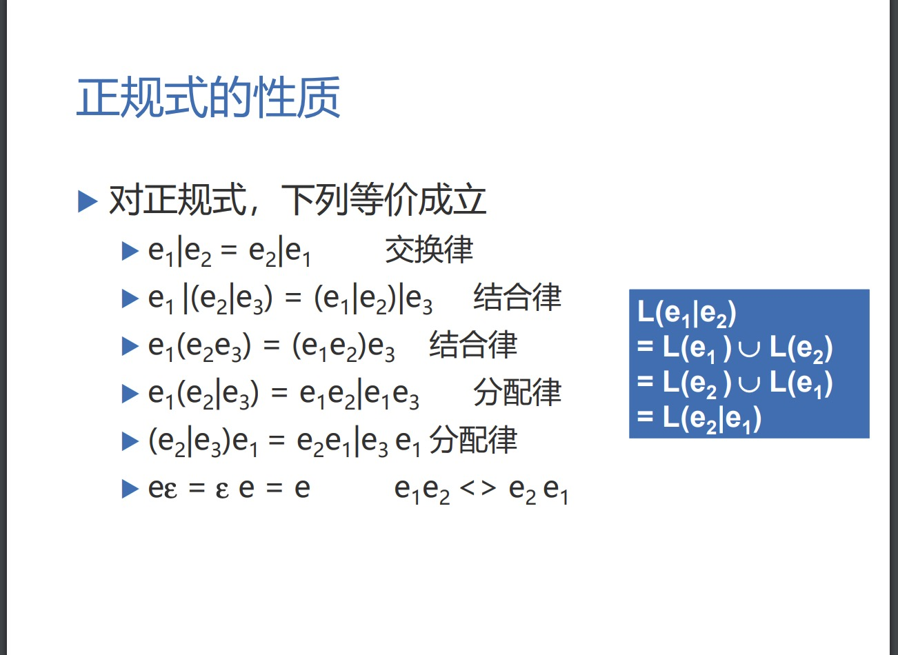

### 词法实现方式

1. 单独一遍源程序，输出结果给语法分析使用
2. 有语法分析驱动， 语法分析需要取下一个单词时调用词法分析子程序， 直到源程序结尾

### 词法分析程序的结构

输入缓冲区 > 预处理 > 扫描缓冲区 > 扫描器

预处理 主要提出无用字符， 空白、换行、回车等编辑性字符、

### 超前搜索

扫描缓冲区 
两个指针 开始指针和搜索指针

开始指针指向即将处理单词的开头， 搜索指针沿着缓冲区向后搜索知道遇到结束字符

这里存在问题， 很长的单词会被截断

解决办法， 

1. 增加缓冲区长度(不可靠)， 无论如何增加也不能保证单词不会被缓冲区打断， 很短的单词也有可能被缓冲区打断 
2. 将缓冲区分为两部分， 每次只读入缓冲区长度一半的字符， 如果扫描指针到当前缓冲区的末尾仍然没遇到结束字符，则读入另一半缓冲区， 只要保证最长标识符不要大于缓冲区一半就能保证每次都能读取一个完整的单词。大部分语言都有规定最长标识符长度， 因此扫描缓冲区的长度就是最长标识符长度的两倍。

### 正规式， 正规集

#### 语法描述的几个基本概念

* `正规集`可以用`正规式`表示
* `正规式`是表示正规集一种方式
* 一个字集合是正规集当且仅当它能用正规式表示

#### (a*b*)*=(a|b)* 

若两个正规式所表示的正规集相同，则称这两
个正规式等价。

(a|b)* = a* | b* = { a, b, aaa, bbb, abab, aaabbb .... }

(a*b*)* = { a, b, aaa, bbb, abab, aaabbb ....}

正规式的性质

### 状态转换图

### 确定有限自动机(DFA)

优点 程序易于实现

`M = (S, f, S0, F)`

### 非确定有限自动机(NFA)

* 输入不是单个字符(一个字或者可以是一个正规式)
* 同状态输入同一个字到达的状态可能是多个(不确定)
* 多个初始状态
* 终态集 多个终态

优点 表达能力强，对人友好的设计工具

DFA 是 NFA 特例 

确定有限自动机和非确定有限自动机接受的集合相等则二者等价

### DFA 和 NFA 等价性证明

* 对于每个NFA M存在一个DFA M’，使得
L(M)=L(M’)
 等价性证明
 NFA的确定化

证明过程

1. 引进新的初始节点和结束节点，使得新初始节点到原初始节点(可能多个)都通过ε弧(表示空)链接， 同理新结束节点到原结束节点(多个) 也都通过ε弧连接。 这样就满足了`DFA`只有一个初始和结束节点的性质。
2.对M的状态转换图进一步施行替换，其中k是新引入的状态。 如下

对每个复杂的弧用以上方式简化

3.  消除ε 弧比较复杂 参考国防科大`王挺`编译原理课程。

### DFA 化简

* 状态的等价的定义

假设s和t为M的两个状态，称s和t等价：如果从状态
s出发能读出某个字
α而停止于终态，那么同样，从t
出发也能读出
α而停止于终态；反之亦然
可以是不同的终态

状态的可区分

* 两个状态不等价，则称它们是可区别的

* DFA 的化简就是将所有等价状态划分为一组， 然后取这一组其中的一个做为新状态

* DFA 目的就是减小状态表的大小，以达更高效的DFA

